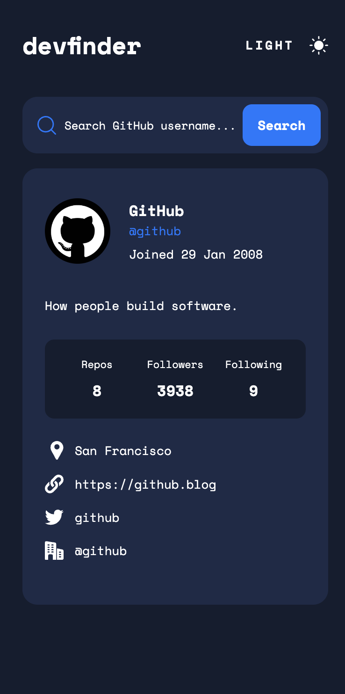
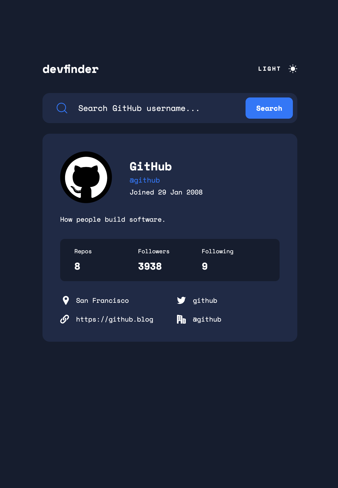

# Frontend Mentor - GitHub user search app solution

This is a solution to the [GitHub user search app challenge on Frontend Mentor](https://www.frontendmentor.io/challenges/github-user-search-app-Q09YOgaH6). Frontend Mentor challenges help you improve your coding skills by building realistic projects.

## Table of contents

- [Frontend Mentor - GitHub user search app solution](#frontend-mentor---github-user-search-app-solution)
  - [Table of contents](#table-of-contents)
  - [Overview](#overview)
    - [The challenge](#the-challenge)
    - [Screenshot](#screenshot)
    - [Links](#links)
  - [My process](#my-process)
    - [Built with](#built-with)
  - [Installation](#installation)
    - [Install dependencies](#install-dependencies)
    - [Run Application](#run-application)

## Overview

### The challenge

Users should be able to:

- View the optimal layout for the app depending on their device's screen size
- See hover states for all interactive elements on the page
- Search for GitHub users by their username
- See relevant user information based on their search
- Switch between light and dark themes
- **Bonus**: Have the correct color scheme chosen for them based on their computer preferences. _Hint_: Research `prefers-color-scheme` in CSS.

### Screenshot

Mobile Screenshot



Tablet Screenshot



Desktop Screenshot


### Links

- Solution URL: [Repository](https://github.com/evertzner/github-user-search-app)
- Live Site URL: [Planet Facts](https://github-user-search-esteban-vertzner.netlify.app/)

## My process

### Built with

- Astro
- Tailwind CSS

## Installation

### Install dependencies

```bash
pnpm install
```

### Run Application

```bash
pnpm run dev
```
